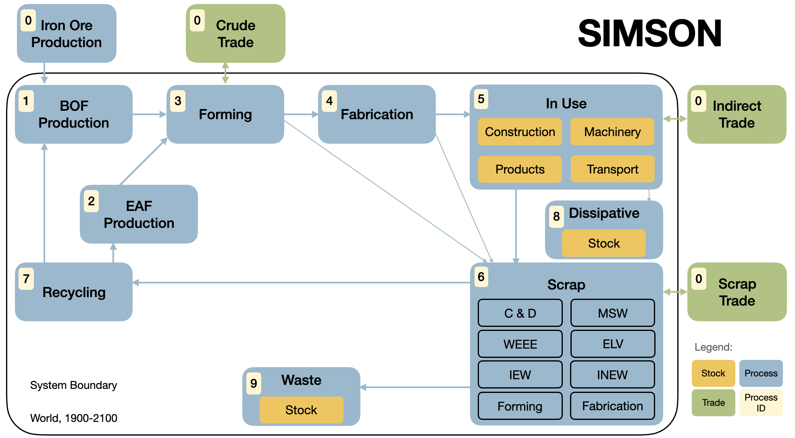

## SIMSON - an introduction

Back to [overview](../README.md).

In order to model the global steel cycle (and potentially other materials in the future),
the Potsdam Institute for Climate Impact Research (PIK) has set up their model SIMSON: 'Simulation 
In-Use Material Stocks with the ODYM Network'. 

It is based on dynamic stock modelling (DSM) and material flow analysis (MFA) as well as various prediction techniques.
In this article, we are presenting SIMSON's:

1. [MFA Structure](#structure)
2. [Index Table](#index-table)
3. [Flows](#flows)

### Structure

Here is an overview of the SIMSON MFA structure:

SIMSON uses a total of 10 process with process IDs 0-9, 
where '0' represents all processes outside of its system boundary. 
In this section we briefly summarise the steel cycle as conceptualised by SIMSON, 
mentioning the process IDs along each step.

It distinguishes between two production routes: from flast furnace to basic
oxygen furnace (BOF, 1) and the electric arc furnace (EAF, 2) via direct reduction. The iron ore necessary 
for steel production is seen as exogenous to the system (0). Steel is formed into intermediate products
like sheets and rods in the forming process (3), and subsequently 'fabricated' (4) into end use products
like cars and machinery. 

After the 'In-Use' phase (5), steel reaches its end of live, 
is collected as scrap (6) or left in the landscape ('Dissipative', 8) and then recycled (7)
or ends up in landfill waste (9).

Additionally, steel trade occurs between the various world regions. We distinguish between crude steel trade,
indirect trade (trade of steel products in the use-phase, like the export of second-hand cars) and scrap trade.

### Index Table

The *Open Dynamic Material Systems Model (ODYM)* is a Python framework for
*DSM* and *MFA*. It realises flows and stocks via *NumPy* arrays, and the array's dimensions represent
various aspects of the MFA/DSM systems that are summarised by an *index table* in *ODYM*. 

These index tables assign every dimension (row) of an MFA a name and letter, which then can be used swiftly in 
'*Einstein sums*' in *NumPy*. 

The index table of SIMSON, along with the values that the indices of every dimension 
represent is shown here:

| Name   | Letter | Values                                                                                                                                                                               |
|--------| --- |--------------------------------------------------------------------------------------------------------------------------------------------------------------------------------------|
| Time | t | 1900-2100 (total of 201 years)                                                                                                                                                       |
| Element | e | *Fe (Iron)* for now, *Cu (Copper)* planned in future                                                                                                                                 |
| Region | r | 12 *REMIND* regions or 10 *Pauliuk* regions sorted alphabetically                                                                                                                    |
| In-use goods | g | *Construction*, *Machinery*, *Products*, *Transport*                                                                                                                                 |
| Waste | w | 10 Waste categories: 6 according to *Wittig* (*construction & development*, *municipal solid waste*, etc.), *forming* & *fabrication* scrap, *dissipative* & *not collectable* waste |
| Scenario | s | 5 SSP scenarios (SSP1, SSP2, etc.)                                                                                                                                                   |

A certain flow $F_{Production-Forming}$ in the MFA might for example be made
up of a three-dimensional NumPy array representing the three aspects time, element and region
and hence have the shape `(201,1,12)` as the time dimension covers 201 years, the element dimension
covers one dimension (Iron/*Fe*), and the region dimension covers the twelve REMIND regions, sorted alphabetically.

### Flows

Finally, we can mathematically denote the calculation of the flows, or at least the relationship between the 
flows as they are calculated differently in specific circumstances (see the chapter on modelling approaches [here](bachelor.hosak.pdf)).

$I(t,e,r,g)$ and $O(t,e,r,g)$ are the inflows and outflows as calculated in the dynamic stock modelling of the use-phase. $T^{.}$ refers to net trade 
data (crude, indirect, scrap) and could be specified to imports ($T^{I}$) and exports ($T^{E}$). $Y$ are production 
yields (forming, fabrication), $D$ distributions (taken from Wittig), $V$ other values/parameters. 
$P$ refers to the total production of crude steel, $S$ to the total amount of scrap.

For all flows, losses are not considered yet. $F_{A-B}$ denotes the flow between process $A$ and $B$ as labelled in the structure above. 
All process outside of the system boundary are considered to be part of the 'Environment'(Env) process (all trade and the iron production).

$$F_{Env-Use}(t,e,r,g) = T_{indirect}^{I}(t,e,r,g)$$

$$F_{Use-Env}(t,e,r,g) = T_{indirect}^{E}(t,e,r,g)$$

$$F_{Fbr-Use}(t,e,r,g)=I(t,e,r,g)-T_{indirect}^{I}(t,e,r,g)+T_{indirect}^{E}(t,e,r,g)$$

$$F_{Fbr-Scr}(t,e,r,g) = F_{Fbr-Use}(t,e,r,g) (\frac{1}{Y_{Fbr}(g)}-1)$$

$$F_{Frm-Fbr}(t,e,r) = \sum_g(F_{Fbr-Use}(t,e,r,g) + F_{Fbr-Scr}(t,e,r,g))$$

$$F_{Frm-Scr} = \frac{F_{Frm-Fbr}(t,e,r)}{Y_{Frm}}-F_{Frm-Fbr}(t,e,r)$$

$$F_{Env-Frm}(t,e,r) = T_{crude}^{I}(t,e,r)$$

$$F_{Frm-Env}(t,e,r) = T_{crude}^{E}(t,e,r)$$

$$P(t,e,r) = F_{Frm-Fbr}(t,e,r) + F_{Frm-Scr}(t,e,r) + T_{crude}^{E}(t,e,r) - T_{crude}^{I}(t,e,r)$$

$$F_{Use-Scr}(t,e,r,g,w) = O(t,e,r,g)D_{Use-Scr}(g,w)$$

$$F_{Env-Scr}(t,e,r,w)=T_{scrap}^{I}(t,e,r,w)$$

$$F_{Scr-Env}(t,e,r,w)=T_{scrap}^{E}(t,e,r,w)$$

$$S_{available}(t,e,r,w) = \sum_gF_{Use-Scr}(t,e,r,g,w) + T_{scrap}(t,e,r,w)+ \sum_gF_{Fbr-Scr}(t,e,r,g) + F_{Frm-Scr}(t,e,r)$$

$$S_{recyclable}(t,e,r) = \sum_wS_{available}(t,e,r,w)D_{Scr-Rcy}(w)$$

$$S_{prod-usable}(t,e,r) = min(S_{recyclable}(t,e,r),P(t,e,r)V_{maxScrapShareProduction})$$

$$F_{EAF-Frm}(t,e,r) = min(0, \frac{\frac{S_{prod-usable(t,e,r)}}{P(t,e,r)}-V_{scrapShareBOF}}{1-V_{scrapShareBOF}})P(t,e,r)$$

$$F_{Rcy-EAF}(t,e,r) = F_{EAF-Frm}(t,e,r)$$

$$F_{BOF-Frm}(t,e,r) = P(t,e,r) - F_{EAF-Frm}(t,e,r)$$

$$F_{Rcy-BOF}(t,e,r) = F_{BOF-Frm}(t,e,r)V_{scrapShareBOF}$$

$$F_{Env-BOF}(t,e,r) = F_{BOF-Frm}(t,e,r) - F_{Rcy-BOF}(t,e,r)$$

$$F_{Scr-Rcy}(t,e,r) = F_{Rcy-EAF}(t,e,r) + F_{Rcy-BOF}(t,e,r)$$

$$F_{Scr-Wst}(t,e,r) = \sum_wS_{available}(t,e,r,w) - F_{Scr-Rcy}(t,e,r)$$

*Go to section 2:* [Installation](Installation.md)