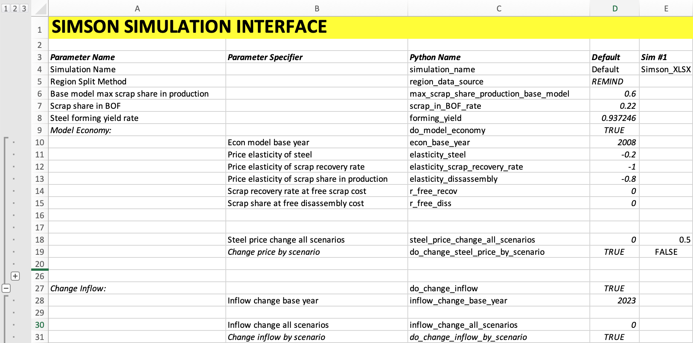
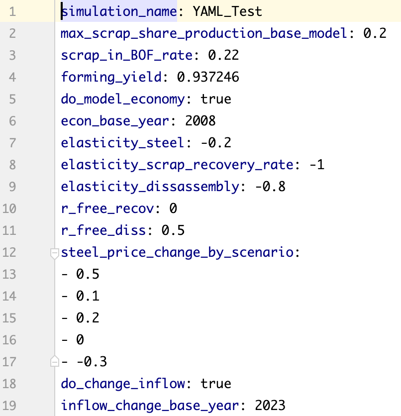

# The Simulation Module

Back to [overview](../README.md).

In order to allow running and comparing various simulations
swiftly and make SIMSON useable to non-programmers, the *Simulation Module*
was added.

In this page the module will be described covering the 
following aspects:

1. [Simulation Parameters](#simulation-parameters)
2. [Excel Interface](#excel-interface)
3. [YAML Interface](#yaml-interface)
4. [Running simulations](#running-simulations)
5. [Output](#output)

### Simulation Parameters

For every simulation, a set of configurations or parameters can
be set. Hence, the results of the simulation can be compared to show
the effect that the change of a certain parameter has on the steel
cycle predictions.

The set of changeable configurations that we call simulation parameters here
are described in the table below. They are comprised of static factors like 
the simulation name, various estimates of factors in the steel cycle like
the maximum scrap rate in production as well as assumptions
on the development in the five shared socio-economic pathway (SSP) scenarios.

| Parameter Name                                                      | Default value | Possible range | Notes |                                                                     
|---------------------------------------------------------------------|---------------|-----------|---------------------------------------------------------------------------|
| Simulation Name                                                     | Default       | Any text without ||
| Max. scrap share in production                                      | 0.6           | 0-1       | For base model, e.g. 0.6 = 60 %                                           |
| Scrap share in BOF                                                  | 0.22          | 0-1       | Percentage of secondary steel in basic oxygen furnace route               |
| Forming yield                                                       | ca. 0.93      | 0-1       | Yield of steel during the steel forming process, taken from Cullen (2012) |
| Model economy                                                       | False         | True / False | Use the economy module or not|
| Model economy - base year                                           | 2008          | 2008-2099 | the starting year of the economic module |
| Elasticity of steel, scrap recovery rate, scrap share in production | -0.2,-1,-0.8  | Negative, 0 | Price elasticities of demand for the economic module |
| Initial scrap recovery rate and share in production                 | 0, 0          | 0-1       | Recov. rate at free scrap cost, Scrap share at free dissassembly cost |
| Steel price change (by SSP scenario)                                | 0 | Real numbers | e.g. -0.2  would result in a linear decrease of steel price from the basee year to -20 % of that in 2100 |
| Inflow change (by SSP scenario and/or product)                      |0 | -1 to ∞   | Like steel price change, steel demand can be manually adapted |
| Reuse rate (by SSP scenario and/or product)                         | 0 | 0 to ∞ | Like steel price change, steel reuse rates can be manually adapted, e.g. assuming 0.2 (20 %) of construction materials being reused by 2100 in SSP1 |

### Excel Interface

The simplest way to run several simulations is to use the Excel 
SIMSON simulation interface. It is  located in `simulation/interface/excel` 
and called `simson_simulation_interface.xlsx` (see picture above).

Users can simply fill in the simulation parameters (rows) they wish to test
in the columns from column `D` on. Every column represents one simulation.
Some parameters are grouped together, like configurations for each SSP scenario.
If Users intend to parametrise their simulations to that degree of detail,
they can use the `+` and `-` buttons to expand these rows.

Once the Excel sheet is saved, the simulations can be run 
via the `run_simulations.py` Pythons script as described [below](#running-simulations).

### YAML Interface

Similarly to the Excel Interface, simulations can also be run using YAML. 
YAML is commonly used to store configurations in `.yml` or `.yaml` files.
In SIMSON, such a file represents the configurations for one simulation. When
they are stored in `simulation/interface/yaml` and the `run_simulations.py` is run,
the simulations are run.

An example is shown in the figure above, depicting the `default.yml` file stored
in the same folder that can be used to create custom YAML files for simulations.

Using YAML files like this might allow Users to let other models communicate with SIMSON.

### Running simulations

After installing SIMSON as described in [section 2](Installation.md), the simulations
parametrised in the Excel interface or via YAML files can be run 
via the `run_simulations.py` in the root directory.

This can be down without any programming environment like *Pycharm* or *VSCode* 
but simply via a command line/Terminal. For this, Python and all required libraries need
to be installed and the data needs to have been loaded via the git submodules.
You simply need to enter change the working directory to the root
directory of SIMSON and then run the following command:

`python run_simulations.py`

Depending on how you installed Python, the first term might need to 
be changed to `python2` or `python3`.

### Output

After running the simulations, the output is stored in `simulation/output`.
Each simulation is stored in a seperate folder labelled by the simulation name and time.
The folders each contain three aspects: the SIMSON model as an instance of the ODYM `MFASystem` class
stored in a `pickle` (`.p`) file, a data directory containing `.csv` files for all flows and stocks
across all dimensions as well as a figure directory containing some select aspects of the 
predicted steel cycle. 

*Go to section 4:* [Project Structure](Project_Structure.md)